```{r setup, include = FALSE, cache = FALSE, echo = FALSE}
# chunks options:
# hide code and messages by default (warning, message)
# cache everything 
library(knitr)

knitr::opts_chunk$set(echo = FALSE,
                      warning = FALSE, 
                      message = FALSE,
                      cache = FALSE,
                      fig.retina = 2,
                      out.width = "75%",
                      fig.align = "center", 
                      dpi = 100)
# Xaringan: https://slides.yihui.name/xaringan/
library("xaringan")
library("xaringanthemer")
library("here")


xaringanthemer::style_mono_light(base_color = "#3b444b",
          link_color = "#B7E4CF",
          background_color = "#FAF0E6", # linen
          header_font_google = google_font("PT Sans"),
          text_font_google = google_font("Old Standard"),
          #base_font_size = "20px",
          text_font_size = "35px",
          padding = "10px",
          code_font_google = google_font("Inconsolata"),
          code_inline_background_color    = "#F5F5F5",
          table_row_even_background_color = "#d5e3dd",
          #extra_css =        list(".remark-slide-number" = list("display" = "none")),
          outfile = "xaringan-themer.css")

```


```{r, eval = FALSE, include= FALSE}
# setup
devtools::install_github("yihui/xaringan")
devtools::install_github("gadenbuie/xaringanthemer")
install.packages("webshot")
# webshot::install_phantomjs()

library(webshot)

# export to pdf
file <- here("present/whyMail-APW.html")
webshot(file, "whyMail-APW.pdf")
```


class: inverse

<p style="text-align:center;">YOU MAY ALSO LIKE</p>

[Legislator Advocacy on Behalf of Constituents and Corporate Donors](https://judgelord.github.io/research/ferc/): Legislators are more likely to write letters on behalf of companies whose PACs donate to their campaigns.

[Who Gets Constituency Service?](https://judgelord.github.io/research/correp/): Veterans and seniors are served proportionate to their population; low-income people are not. Republicans do 15% less for low-income constituents (within a district)—no partisan differences in help for businesses.

[Public Pressure and Congressional Oversight](https://judgelord.github.io/research/oversight/): Coalitions mobilize public pressure also mobilize more legislators. Coalitions with more legislators are more likely to win.

???


---

# How do power and experience affect how elected officials allocate their attention and effort?

--

## - Do constituents face a trade-off between influence in Washington and constituency service at home?

--

## - If legislators are given more resources, how will they be used? 
 


---

# Outline

1. Theory: Institutional power has countervailing effects on constituency service

--
(*absolute increase* in capacity **BUT** *relative decrease* as attention/priorities shift to policy work)

--

1. Data: ~500,000 requests from all members of Congress to all federal agencies, 2007-2020

--

1. Methods: change in legislator-agency and  district-agency pairs

--

1. Findings:  Increasing capacity effects overcome simultaneous shifts in priorities. 
--
Even as the *ratio* of policy work increases, legislators maintain or increase their overall *level* of constituency service.

???

We have been working on this project for over five years.

With Justin Grimmer and Ellie Powell, we assemble a very large new database of letters and emails written by members of Congress to federal agencies.

I will [OUTLINE]

To preview our findings [FINDINGS]

---

# Feedback requests

## Framing 

## Robustness 
- selection
- name recognition


---

# Theory: Institutional power & experience

increase capacity
- chairs direct committee staff
- experience and relationships in Washington
- new legislators  $\leadsto$ start-up costs 
- power means that requests are answered 


shift priorities/attention toward policy
- "Potomac fever" (Fenno 1978)
- power means power over policy
- incumbency means security

---

background-image: url("figs/SchumerNeighbor.jpeg")
background-size: contain


---


```{r, out.height="1%", out.width="45%"}

```


- Multitask accountability models: as elected officials acquire power, they should continue attention to their district (Ashworth and Bueno de Mesquita, 2006)

- If true, newly elected officials  $\leadsto$ startup costs 


???

# Policy goals and Reëlection

Dividing effort between policy goals and particularistic service presents a significant tension for representation.

Reëlection-minded officials should allocate resources to particularistic service ~(Ashworth and Bueno de Mesquita, 2006)~


---


background-image: url("figs/DickLugar.png")
background-size: cover

## "Potomac fever" (Fenno 1978)

---

background-image: url("figs/crowley.jpg")
background-size: cover


---


background-image: url("figs/CruzHearing1.jpg")
background-size: cover


<p style="color:white;">
"...members of Congress get re-elected, and the system works for everyone except the American people. This kind of self-interest builds on itself as members spend more time in office."
</p>

---


We build on recent work that focused on legislator contacts with specific agencies. 

- Represent constituents' policy demands despite party pressure (Ritchie 2017)

- Constituents and institutional position, not ideology, drive policy oversight (Lowande 2018) 

- Descriptive $\rightarrow$ substantive representation (Lowande, Ritchie, Lauterbach, 2019)

- Bureaucrats have reasons to comply with legislator requests, and they do (Ritchie and You, 2019)

???

Molly Ritchie finds that when legislators face cross-pressures on policy issues, they directly engage the bureaucracy to still represent constituents even though party politics keep them from doing so legislatively.

Kenny Lowande, also focusing on policy, finds that partisan disagreement with the executive branch does not drive oversight.

Lowande, Ritchie, and Lauterbach show that legislators make more requests on behalf of constituents with whom they share marked identities.

- Bureaucrats have reasons to comply with legislator requests, and they do (Ritchie and You, 2019)

 Ritchie and You and Mills and Kalaf-Hughes have begun to investigate whether legislator requests matter and find that they do.

Building on this work, we focus squarely on constituency service [SLIDE]

---

## Our comprehensive data allow us to study legislator behavior *in general*, policy work *and* constituency service

"help to individuals, groups, and localities in coping with the federal government." (Fenno, 1978: p. 101)

-   Individual casework

-   Organized groups

-   Unorganized groups

-   Companies

???

Representation goes beyond floor votes.

Indeed, there are far more intimate forms of representation that are less constrained by parties and chamber procedure.

Possibly the most common act of representation is helping constituents deal with the bureaucracy. 

This has been true since legislators helped constituents get pensions after the revolutionary war and especially with the rise of the administrative state. Federal agencies now shape nearly every aspect of our lives: 

Here we focus on individual casework and a bit on help for companies. We talk more about companies and organized groups in other papers, which I would be happy to send you if you are interested. 


---

class: inverse center middle

# Data: FOIA all contacts from members of Congress 2007-2018 

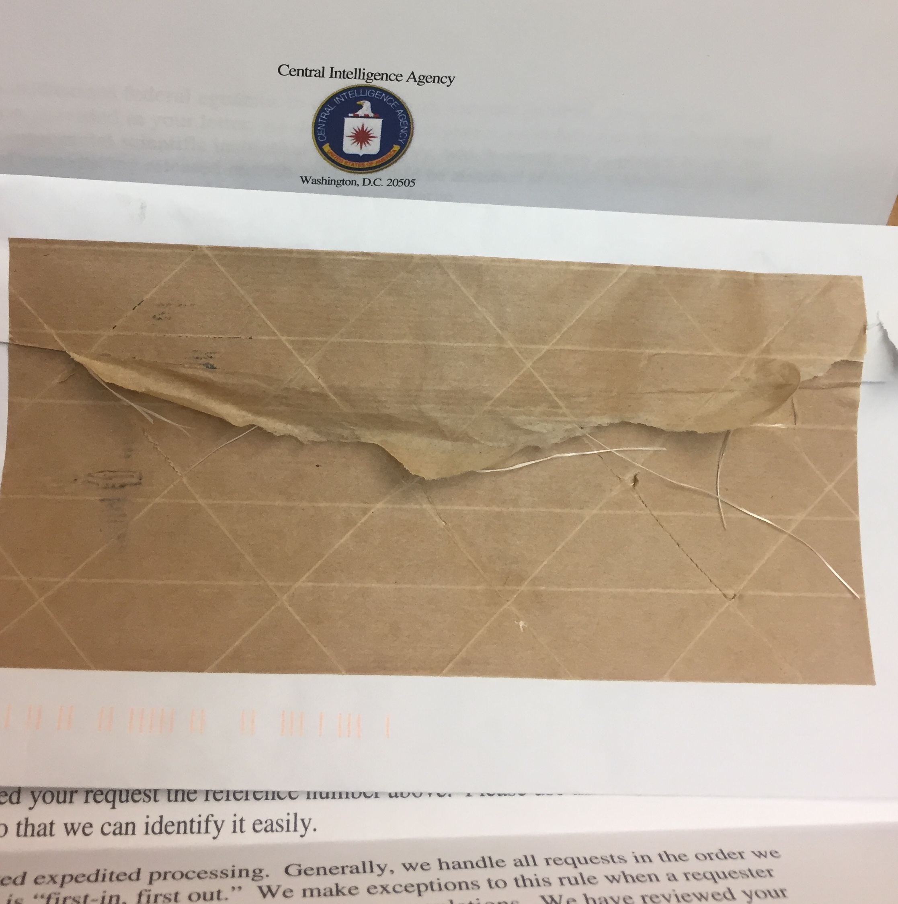

??? 

To give you a sense of the range of responses. Some agencies provided letters themselves,

A small portion of these data

---

background-image: url("figs/FERC.png")
background-size: contain

???

 For example, here, Rep. Thornberry, chair of the armed services committee, is writing to Federal Energy Regulatory Commission on behalf of two companies in his district, asking for extra scrutiny on another company's permit application. 

 We have several thousand such letters written to this agency, which we use optical content recognition to extract the text. If they do not have metadata like the sender's name and date, we extract it from the text of the letter or description of the letter.
 
---

background-image: url("figs/schumer-cosigned-letter-tweet.png")
background-size: contain


???


---

Environmental Protection Agency

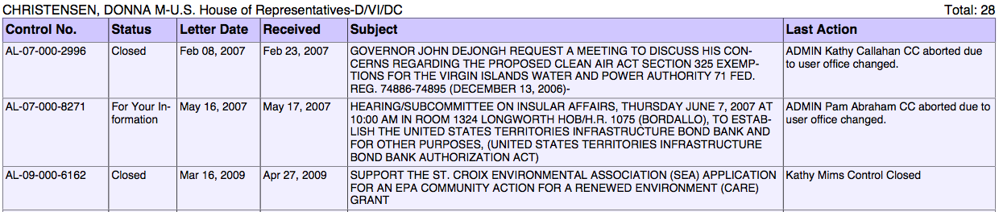


???
Rich and informative summaries like those kept by the EPA. Here, Rep Donna writes about a regulatory exemption for a power plant to alert the EPA to a hearing and support a nonprofit grant application.


???

Other agencies provided logs, which range widely in the information they record. 

These logs from the VA don't say much, but often enough to deduce what the letters were about.

I am going to quickly click through a few more examples just to give you an idea of the range of these data.

---

VA Detroit Regional Offices

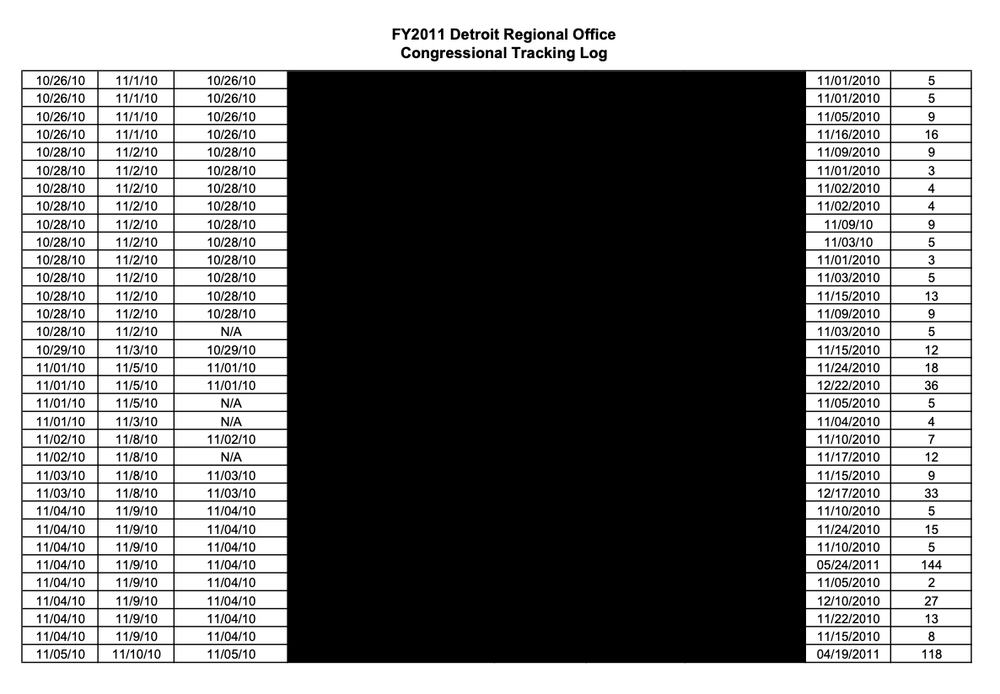

???

These were distinct from VA HQ, illustrating the import of our comprehensive approach.

---

VA National Cemetary Administration

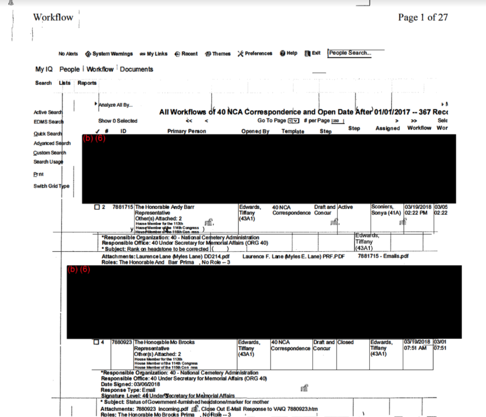

---

Department of Homeland Security Immigration and Customs Enforcement
(ICE) 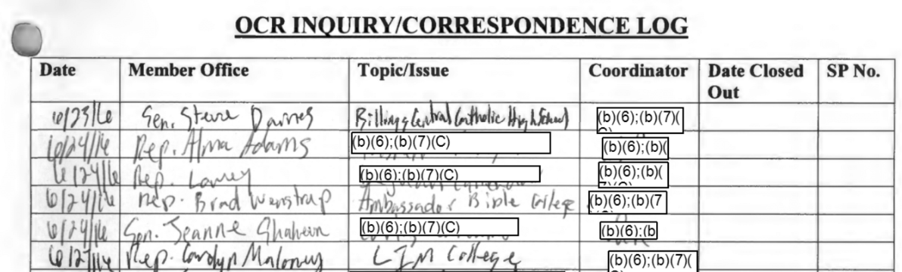

???

at the worst, handwritten logs with obscure acronyms to indicate the topic, as in this log from ICE

---

Department of Homeland Security Immigration and Customs Enforcement
(ICE) 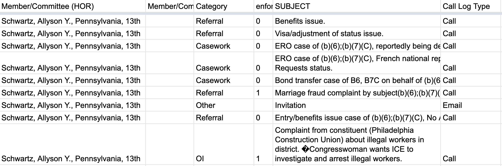

???

at the worst, handwritten logs with obscure acronyms to indicate the topic, as in this log from ICE

---

IRS
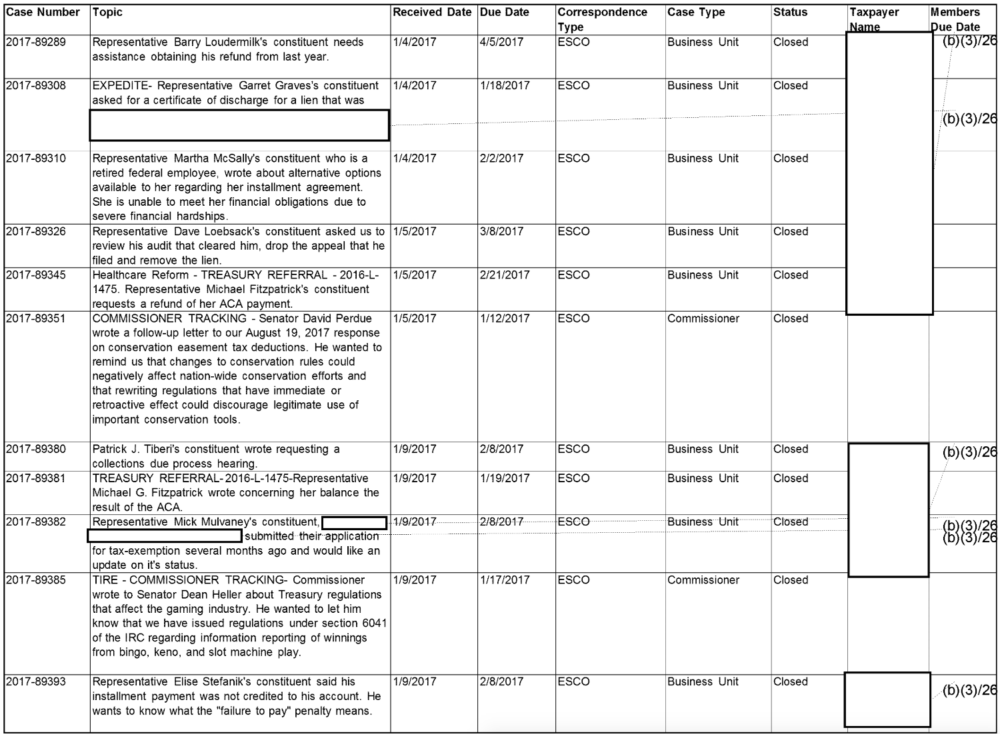

---

Centers for Medicare & Medicaid Services
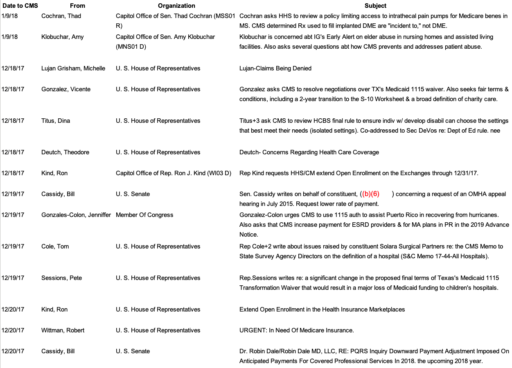

---

429 FOIA requests to 294 federal agencies (a census)

485,000+ legislator requests (so far), 2007-2020

```{r, echo=FALSE, warning=FALSE, message=FALSE}
library(kableExtra)
library(tidyverse)
read_csv(here::here("data/_FOIA_response_table.csv")) %>% select(-ends_with("1")) %>% 
  mutate(Department = Department %>%
           str_remove("Department of "))  %>%
  select(-Coded) %>%
  rename(N = Observations) %>% 
  kable() %>%
  row_spec(row = 16, hline_after = TRUE) %>%
  row_spec(row = 17, bold = T, background = "#B7E4CF") %>% 
  kable_styling(font_size = 12)
```

---

Hand coding $\leadsto$ 79% overall agreement, 90% when coders are certain
	
## Over 80% Constituency Service


---

## Constituent Demand

```{r, out.width="68%"}
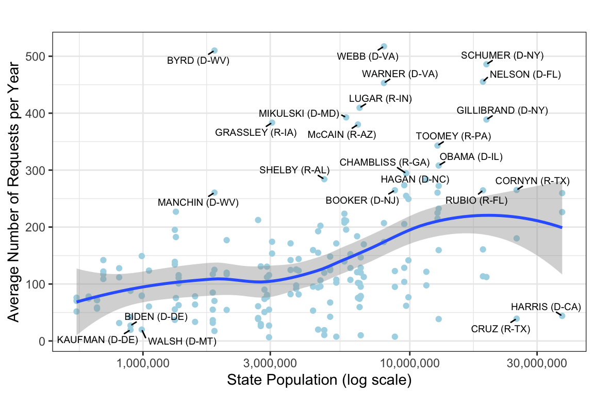
```

---

## Constituent Demand


## 	District demographics are correlated with types of requests legislators make
	

- Higher proportion of veterans $\leadsto$ more requests to VA

- Higher proportion of residents over 65 $\leadsto$ more requests to SSA 

---

## Unequal Levels of Advocacy Overall

```{r, out.width="80%"}
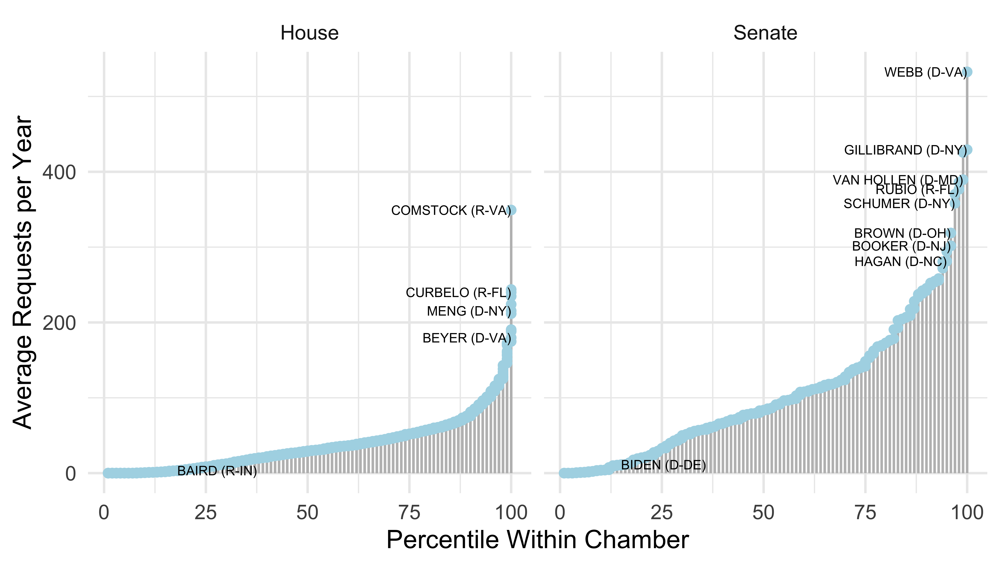
```

---


class: inverse center middle

# Models

---

# Outcome

Cross-sectional differences across legislators for a given agency in a given year

Change within legislative-agency and district-agency dyads (difference in differences) + year*agency fixed effects

- DV 1: **volume** of constituency service 
- DV 2: **ratio** of policy work to constituency service


---

```{r, out.width="80%"}
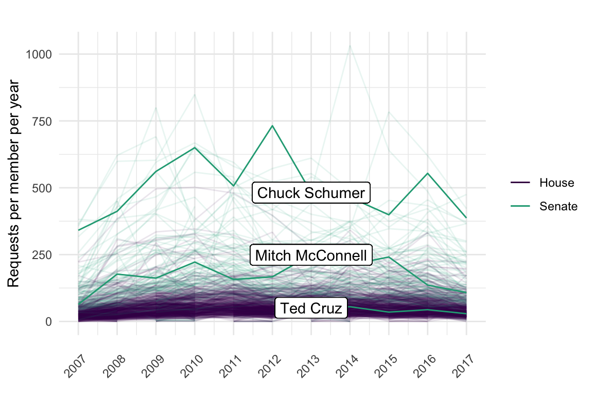
```

---


# Explanations

Institutional power
- committee chair 
- ranking member
- prestige committee member

Experience
- years in office
- newly elected (within district models)

Controls: majority party, president's party

---


## Results: The Effects of Increased Resources and Prestige


DV 1: Volume $\uparrow$ 
- ~ 14 additional contacts per year when becoming chair (25% of one standard deviation in the number of contacts), smaller effects for ranking member or prestige committee 

--

DV 2: Ratio of $\frac{Policy}{Service}$: $\uparrow$ 
- ~ 9 percentage point change for committee chairs
--

Combined: slight increase (no decrease) in constituency service -- 

Increasing power (and budget) $\leadsto$ maintaining attention to their district, despite prioritizing policy


---

## Results: Startup Costs and New Legislators

- Within legislator analysis: early career legislator, less service (compared to later in career) 

--

- Within district analysis: replace legislator, less service

--

## Rather than experienced legislators turning from their district, new legislators are less equipped to deliver service


---

## Example:

```{r}
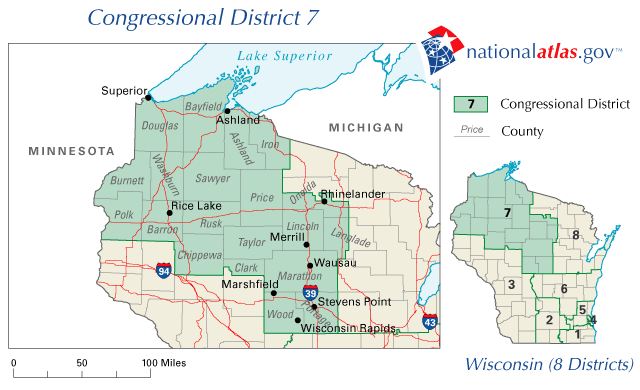
```

???

MTV *The Real World: Boston* start and sports commentator


---

background-image: url("figs/duffy.png")
background-size: contain

---

## Example: Level of constituency service within districts

Sean Duffy initially provided less constituency service than 20-term Rep. Dave Obey but was on par by year 3.

```{r}
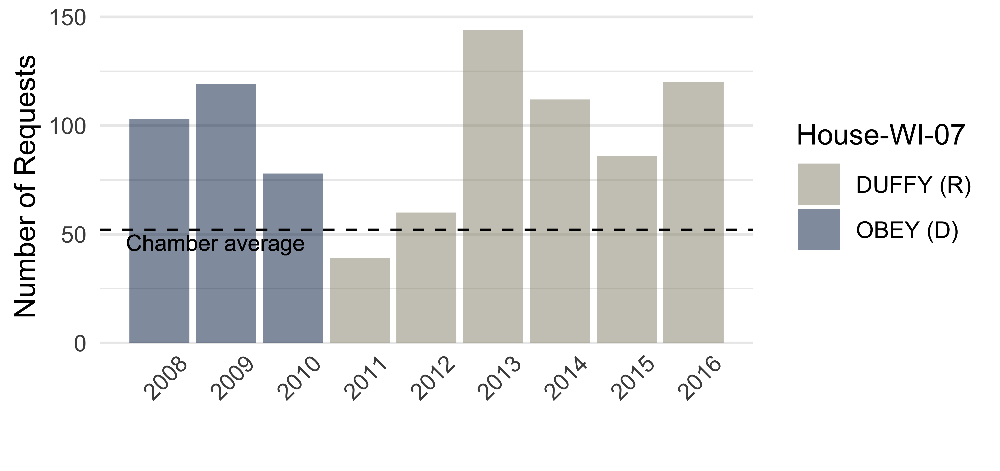
```

---

## Example: Level of constituency service within districts

Constituency service dropped in the transition from Feingold to Johnson and from Kohl to Baldwin.

```{r}
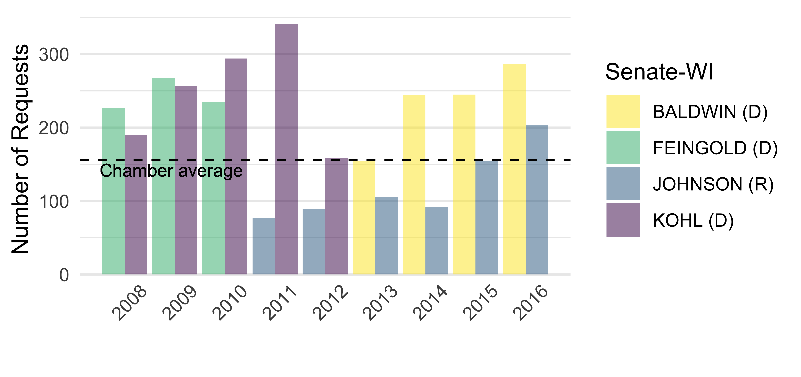
```


---

class: inverse center middle

# Thank you!

---


class: inverse center middle

# Extra Slides


---

$Y_{ijt} = \beta \text{Position}_{it}   + \gamma_{ij} +  \delta_{tj} + \sum_{s = 1}^{S} \eta_{s} \text{tenure}_{s[it]} + m_{it} + p_{it} +  \epsilon_{ijt}$

Where: 

- $Y_{ijt} =$ Number of contacts between legislator $i$ and agency $j$ in year $t$
- $\beta =$ Estimated causal effect of obtaining committee position 
 - Chair of committee
 - Ranking member
 - Prestige committee assignment
 - Oversight committee assignment
- $\gamma_{ij} =$ Legislator $i$ x Agency $j$ fixed effect 
- $\delta_{tj} =$ Year $t$ x Agency $j$ fixed effect
- $m_{it}, p_{it},\sum_{s = 1}^{S} \eta_{s} \text{tenure}_{s[it]}$ time varying controls 
- Standard errors clustered at legislator level

???

(same results if clustered at legislator level)

---

background-image: url("figs/t2.png")
background-size: contain

---

background-image: url("figs/t3.png")
background-size: contain

---

background-image: url("figs/t4.png")
background-size: contain

---


background-image: url("figs/t6.png")
background-size: contain


---

## Are legislators merely reacting to changing constituent demand?

- Research design addresses static and slow-moving demand
--

- Demand for constituency service can be (and often is) created 
--
$\leadsto$ different mechanism

--

But do constituents direct requests to more powerful and experienced legislators? 
--
(for reasons not caused by legislator efforts) 
--
e.g., media coverage of policy debates


---


```{r, out.width="70%"}
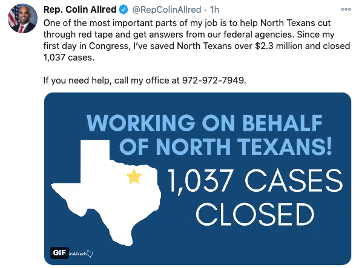
```


---

## Exogenous but correlated demand: 


Test 1: When one new senator is elected, does the longer-serving senator receive a bump? 
--
 **No.**

--

Test 2: Name recognition? 
--
**Downstream of treatment.**

--

## More Robustness Checks:

Subsets
- by chamber
- only those who were re-elected

---

background-image: url("figs/corr-dag-level-2.png")
background-size: cover

