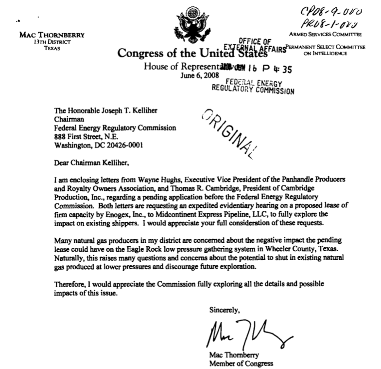

```{r setup, include = FALSE, cache = FALSE, echo = FALSE}
# chunks options:
# hide code and messages by default (warning, message)
# cache everything 
library(knitr)

knitr::opts_chunk$set(echo = FALSE,
                      warning = FALSE, 
                      message = FALSE,
                      cache = FALSE,
                      fig.retina = 2,
                      out.width = "75%",
                      fig.align = "center", 
                      dpi = 100)
# Xaringan: https://slides.yihui.name/xaringan/
library("xaringan")
library("xaringanthemer")
library("here")


xaringanthemer::style_mono_light(base_color = "#3b444b",
          link_color = "#B7E4CF",
          background_color = "#FAF0E6", # linen
          header_font_google = google_font("PT Sans"),
          text_font_google = google_font("Old Standard"),
          #base_font_size = "20px",
          text_font_size = "35px",
          padding = "10px",
          code_font_google = google_font("Inconsolata"),
          code_inline_background_color    = "#F5F5F5",
          table_row_even_background_color = "#d5e3dd",
          extra_css =
            list(".remark-slide-number" = list("display" = "none")),
          outfile = "xaringan-themer.css")

```


```{r, eval = FALSE, include= FALSE}
# setup
devtools::install_github("yihui/xaringan")
devtools::install_github("gadenbuie/xaringanthemer")
install.packages("webshot")
# webshot::install_phantomjs()

library(webshot)

# export to pdf
file <- here("present/whyMail-APW.html")
webshot(file, "whyMail-APW.pdf")
```


# Outline

1. Theory: Institutional power has counterveiling effects on constituency service

--
(*absolute increase* in capacity **BUT** *relative decrease* as attention/priorities shift to policy work)

--

1. Data: ~500,000 requests from all members of Congress to all federal agencies, 2007-2020

--

1. Methods: change in legislatore-agency and  district-agency pairs

--

1. Findings:  Increasing capacity effects  overcome simultanous shifts in priorities. 
--
Even as the *ratio* of policy work increases, the overall *level* of constituency service still increases.

???

We have been working on this project for over five years.

With Justin Grimmer and Ellie Powell, we are assembling a very large new database of letters and emails written by members of Congress to federal agencies.

I will [OUTLINE]

To preview our findings [FINDINGS]

---


# Theory: Institutional power & expiernece

increase capacity
- chairs direct committee staff
- expiernece and relationships in Washington
- new legislators face start-up costs 
- power means that requests are answered 


shift priorities/attention toward policy
- "potomic feaver" (Fenno 1978)
- power means power over policy
- incumbancy means secuirty

---

Dividing effort between policy goals and particularistic service presents a significant tension for representation..

Reelection-minded officials should allocate resourses to particularistic service (Ashworth and Bueno de Mesquita, 2006)

---

background-image: url("figs/SchumerNeighbor.jpeg")
background-size: contain

---

background-image: url("figs/DickLugar.png")
background-size: cover


---


background-image: url("figs/crowley.jpg")
background-size: cover


---


background-image: url("figs/CruzHearing1.jpg")
background-size: cover


---

background-image: url("figs/CruzHearing1.jpg")
background-size: contain


---

We build on recent work that focused on legislator contacts with specific agencies. 

- Represent constituents' policy demands despite party pressure (Ritchie 2017)

- Constituents and institutional position, not ideology, drive policy oversight (Lowande 2018) 

- Descriptive $\rightarrow$ substantive representation (Lowande, Ritchie, Lauterbach, 2019)

- Bureaucrats have reasons to comply with legislator requests, and they do (Ritchie and You, 2019)

???

Molly Ritchie finds that when legislators face cross-pressures on policy issues, they directly engage the bureaucracy in order to still represent constituents even though party politics keep them from doing so legislatively.

Kenny Lowande, also focusing on policy, finds that partisan disagreement with the executive branch does not drive oversight.

Lowande, Ritchie, and Lauterbach show that legislators make more requests on behalf of constituents with whom they share marked identities.

- Bureaucrats have reasons to comply with legislator requests, and they do (Ritchie and You, 2019)

 Ritchie and You and Mills and Kalaf-Hughes have begun to investigate whether legislator requests matter and find that they do.

Building on this work, we focus squarely on constituency service [SLIDE]

---

## Our comprehensive data allow us to study legislator behavior *in general*, policy work *and* constituency service

"help to individuals, groups, and localities in coping with the federal government." (Fenno, 1978: p. 101)

-   Individual casework

-   Organized groups

-   Unorganized groups

-   Companies

???

Representation goes beyond floor votes.

Indeed, there are far more intimate forms of representation that are less constrained by parties and by chamber procedure.

Possibly the most common act of representation is helping constituents deal with the bureaucracy. 

This has been true since legislators helped constituents get pensions after the revolutionary war and especially with the rise of the administrative state. Federal agencies now shape nearly every aspect of our lives: 

Here we focus on individual casework and a bit on help for companies. We talk more about companies and organized groups in other papers, which I would be happy to send you if you are interested. 


---

class: inverse center middle

# Data


---

Federal Energy Regulatory Commission



???

For example, here, Rep. Thornberry is writing to the Federal Energy Regulatory Commission on behalf of two companies in his district, asking for extra scrutiny on another company's permit application. 


We have several thousand such letters written to this agency, in which we use optical content recognition to extract the text. If they do not have metadata like the sender's name and date, we extract it from the text of the letter or description of the letter.

To give you a sense of the range of responses. Some agencies provided letters themselves,

---


---

Environmental Protection Agency


---

Department of Veterans Affairs

???

Other agencies provided logs, which range widely in the amount of information they record. 

These logs from the VA don't say much, but often enough to deduce what the letters were about.

I am going to quickly click through a few more examples, just to give you an idea of the range of these data.

---

VA Detroit Regional Offices


---

VA National Cemetary Administration


---

Department of Homeland Security Immigration and Customs Enforcement
(ICE) 

???

at the worst, handwritten logs with obscure acronyms to indicate the topic, as in this log from ICE

---

Department of Homeland Security Immigration and Customs Enforcement
(ICE) 

???

at the worst, handwritten logs with obscure acronyms to indicate the topic, as in this log from ICE

---

IRS


---

Centers for Medicare & Medicaid Services


---

429 FOIA requests to 294 federal agencies (a census)

485,000+ legislator requests (so far), 2007-2020

```{r, echo=FALSE, warning=FALSE, message=FALSE}
library(kableExtra)
library(tidyverse)
read_csv(here::here("data/_FOIA_response_table.csv")) %>% select(-ends_with("1")) %>% 
  mutate(Department = Department %>%
           str_remove("Department of "))  %>%
  select(-Coded) %>%
  rename(N = Observations) %>% 
  kable() %>%
  row_spec(row = 16, hline_after = TRUE) %>%
  row_spec(row = 17, bold = T, background = "#B7E4CF") %>% 
  kable_styling(font_size = 12)
```

---

class: inverse center middle 

# Descriptive Finding

---

## Over 80% Constituency Service


---

## Consituent Demand

```{r, out.width="68%"}
include_graphics("figs/pop-1.png")
```

---

## Unequal Levels of Advocacy Overall

```{r, out.width="80%"}
include_graphics("figs/percentiles-1.png")
```

---


## Unequal Levels of Advocacy Over time

```{r, out.width="70%"}
include_graphics("figs/counts-per-year-1.png")
```

---

# Methods: Outcome

Cross-sectional differences across legislators for a given agency in a given year

Change within legislatore-agency and district-agency dyads (difference in differences) + year*agency fixed effects

- DV 1: volume of constituency service 
- DV 2: ratio of policy work to constituency service


---

# Methods: Explanations

Institutional power
- committee chair 
- ranking member
- prestige committee member

Experience
- years in office
- newly elected (within district models)

Controls: majoirty party, president's party

---

# Demand

```{r, out.width="70%"}
include_graphics("figs/AllredTwee.png")
```


---

## Exogenous, but correlated demand: 

Constitutents direct requests to better known 

Test 1: When a one new senator is elected does the longer-serving senator recieve a bump?
--
**No.**

--

Test 2: Name recogition

---

# Results 


---

## Example:

```{r}
include_graphics("figs/districts/(WI-07)-map.png")
```

???

MTV *The Real World: Boston* start and sports commentator


---

background-image: url("figs/duffy.png")
background-size: contain

---

## Example: Volume of constituency service within districts

Sean Duffy initially provided less constituency service than 20-term Rep. Dave Obey, but was on par by year 3.

```{r}
include_graphics("figs/districts/(WI-07).png")
```

---

## Example: Volume of constituency service within districts

Constituency service dropped in the transition from Feingold to Johnson and from Kohl to Baldwin.

```{r}
include_graphics("figs/districts/(WI).png")
```

---

## Robustness 

Subsets 
- by chamber
- only those who were reelected


---

class: inverse center middle

# Thank you!

---

class: inverse

<p style="text-align:center;">YOU MAY ALSO LIKE</p>

[Legislator Advocacy on Behalf of Constituents and Corporate Donors](https://judgelord.github.io/research/ferc/): Legislators are more likely to write letters on behalf of companies whos PACs donate to their campaigns.

[Who Gets Constituency Service?](https://judgelord.github.io/research/correp/): Veterans and seniors are served proportionate to their population; low-income people are not. Republicans do 15% less for low-income constituents (within a district). No partisan differences in help for businesses.

[Public Pressure and Congressional Oversight](https://judgelord.github.io/research/oversight/): Coalitions mobilize public pressure also mobilize more legislators. Coalitions with more legislators are more likely to win.

---

class: inverse center

# Extra Slides

---

## From [Who Gets Constituency Service](https://judgelord.github.io/research/correp/)


---

## Variation *Within* Constituent Types

Count of letters per member per year


---

## Variation *Within* Constituent Types

Count of letters per member per year


---

## Variation *Within* Constituent Types

Count of letters per member per year


---

# What explains variation in levels of constituency service across legislators?

## [?] District demographics 
## [?] Partisan-aligned differences in which groups are valorized or stigmatized


---

# District demographics

Overall, **little systematic bias** in which districts receive more service. The average letter comes from an average district (average income, percent below the poverty line, percent over 65, etc.).

### Sub-constituency size 

[ $\checkmark$ ] Strong relationships between the percent of **seniors** or **veterans** and the number of letters on behalf of these groups.

[  $\unicode{x2718}$ ]  No relationship between the **percent below the poverty line** or **median income** and letters on behalf of poor or working-class constituents (e.g., regarding means-tested programs)

---
## Partisan differences (in differences)


---

Republicans provide less service overall, much less to poor constituents,


---

but no difference in service to businesses, seniors, or military families.


---

### Questions going forward:

Can we attribute unequal representation to  
1. structural features of federalism in the U.S.?
1. members perceiving groups as "deserving"?
1. second-order constituent beliefs about whether officials will help them?

Other informative analyses?
- immigrants
- non-White constituents
- disability 

Why do Republicans do less constituent service? 

???

For our questions going forward, I again want to lament the fact that Rochelle is not here because her dissertation is exactly about why constituents contact legislators and will help us get at the first question about whether we can parse the reasons for unequal representation that we find. Is it because elected officials discriminate or that constituents don't even bother reaching out to legislators who they don't believe will help them? 

Are low-income constituents paying close enough attention to who is in office that they stop seeing help when a republic takes over, or do Republican legislators put less priority on this type of representation? 


